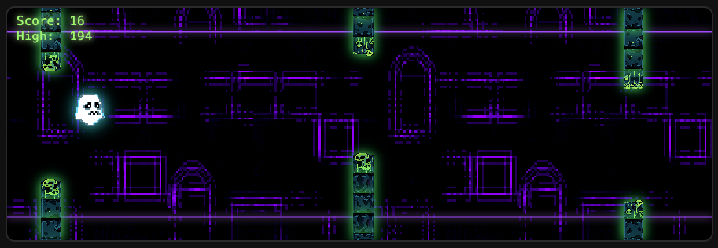

 # GhostRun

🎮 **Play the game here → [GhostRun on GitHub Pages](https://prcpham-dev.github.io/GhostRun/)**

A simple endless runner game built with **HTML5 Canvas** and vanilla **JavaScript**, where the player flips gravity to dodge pillars. Inspired by "Flappy Bird".

# 👻 Gameplay

- Control a **little ghost** that can flip between the floor and the ceiling.  
- **Avoid the pillars** that spawn with random gaps.  
- The game speed **increases the longer you survive**.  
- Your **score** increases with time and obstacles cleared.  
- Your **high score** is saved locally in your browser using `localStorage`.  

## 🕹 Controls

| Action              | Keyboard        | Mouse / Touch  |
|---------------------|-----------------|----------------|
| **Flip gravity**    | `Space`         | Click / Tap    |
| **Pause / Resume**  | `P`             | Pause button   |
| **Restart**         | `R`             | Restart button |

- Press **Space** after crashing to restart quickly.  
- You can also use the **Start / Pause / Restart** buttons in the HUD.

## ⚙️ How It Works

- **Canvas Rendering**: Game visuals are drawn on an HTML `<canvas>`.
- **Game Loop**: Uses `requestAnimationFrame` for smooth updates.
- **Physics**:
  - Gravity pulls the player toward the floor or ceiling.
  - Flipping reverses gravity and gives a little bounce.
- **Obstacles**:
  - Pillars spawn with a random gap between them.
  - Speed increases over time for added difficulty.
- **HUD**:
  - Score and high score displayed in the top-left corner.
  - Game state messages (`Paused`, `Game Over`, etc.) shown at the center.

## Credits
- Art & Design: A huge thanks to **Tai** for creating the **LittleGhost character** and all of the **art assets** (HUD, sprites, and visuals) used in this game.  
- Sounds: Generated with [sfxr](https://sfxr.me/).
- Inspiration: Gameplay inspired by *Flappy Bird*, *Dinosaur game* maybe other games.